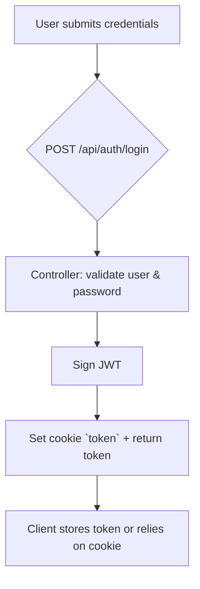
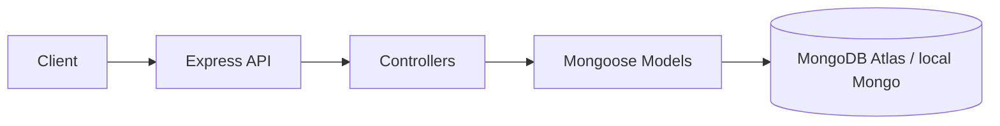

<!--
  Banking Ledger System - README
  Generated: 2026-05-19
-->
# Backend Ledger — Banking Ledger System


Professional, production-ready backend for a Banking Ledger System. This service exposes a secure REST API for user authentication, account management, ledger entries, and atomic transactions with idempotency and email notifications.

---

## Overview

- This application is a backend ledger service that manages user accounts, transactions, and immutable ledger entries.
- Purpose: Provide a secure, auditable ledger for banking-style transfers with strong guarantees (idempotency, transactional commits, immutable ledger entries).
- Intended users: End users (account holders), system users (for creating initial/system funds), and administrators (can be implemented on top of system-user routes).

---

## Features

- Authentication: User registration, login, logout using JSON Web Tokens (JWT) with cookie support.
- Authorization: Role checks for system-level routes using `systemUser` flag.
- Transactions: Transfer between accounts with a 10-step flow ensuring validation, idempotency checks, ledger entries, and transactional DB commits.
- Ledger management: Immutable debit/credit ledger entries; prevents updates/deletes after creation.
- Account management: Create accounts, fetch user accounts, compute account balance via ledger aggregation.
- Session handling: Authentication via secure HTTP-only cookies and header token support.
- JWT authentication: Tokens issued on register/login and validated by middleware.
- Role-based access control: `authSystemUserMiddleware` ensures only system users run privileged flows.
- Validation: Mongoose schema validation for required fields, enums, and formats.
- Error handling: Controllers return informative HTTP status codes and structured JSON messages.
- API functionality: RESTful endpoints for auth, accounts, and transactions.
- Security features: Password hashing with bcrypt, token blacklist for logout, cookie usage, token expiry, input validation.
- Logging: Console logging for important events (DB connect, email transporter verification, server start).
- Middleware usage: Centralized `auth.middleware` to protect routes and handle token blacklist checks.
- Database integration: MongoDB via Mongoose; transactions supported via Mongoose sessions.
- Email notifications: Nodemailer powered transactional emails for registration and transaction events.

---

## Tech Stack

- Backend: Node.js, Express
- Database: MongoDB (Mongoose)
- Authentication: JSON Web Tokens (jsonwebtoken), cookies
- Password hashing: bcryptjs
- Email: Nodemailer (OAuth2 Gmail example)
- Dev tools: nodemon (via `npm run dev`)
- Environment: dotenv
- Testing: (not included) — suggest Jest / Supertest for API tests

---

## Concepts Implemented

- JWT Authentication: Tokens issued at login/registration and verified in middleware.
- Sessions & Cookies: Token written to cookie `token` for browser clients.
- REST API architecture: Clear routes under `/api/auth`, `/api/accounts`, `/api/transactions`.
- MVC architecture: `models/`, `controllers/`, `routes/` separation.
- Middleware: `auth.middleware` centralizes auth and role checks.
- Protected routes: All account and transaction routes require authentication.
- Request validation: Mongoose schema validation on models; controller-level required-field checks.
- Authentication flow: Register → create user → sign JWT → set cookie; Login → validate password → sign JWT → set cookie; Logout → clear cookie + blacklist token.
- Error handling middleware: Controllers return consistent JSON errors (custom middleware may be added later).
- Database relationships: `Account` references `User`, `Ledger` references `Account` and `Transaction`, `Transaction` references `Account`.
- Async operations: Async/await used throughout; Mongoose sessions for atomic operations.
- Environment variables: `dotenv` used for secrets and external service credentials.
- Secure password hashing: `bcryptjs` with pre-save hook.
- Token handling: Token blacklist with TTL to invalidate tokens on logout.
- CORS handling: Can be added if needed (not currently present in `src/app.js`).

---

## Folder Structure

```
backend-ledger/
├─ package.json
├─ server.js
├─ README.md
├─ src/
│  ├─ app.js
│  ├─ config/
│  │  └─ db.js
│  ├─ controllers/
│  │  ├─ auth.controller.js
│  │  ├─ account.controller.js
│  │  └─ transaction.controller.js
│  ├─ middleware/
│  │  └─ auth.middleware.js
│  ├─ models/
│  │  ├─ user.model.js
│  │  ├─ account.model.js
│  │  ├─ transaction.model.js
│  │  ├─ ledger.model.js
│  │  └─ blackList.model.js
│  ├─ routes/
│  │  ├─ auth.routes.js
│  │  ├─ account.routes.js
│  │  └─ transaction.routes.js
│  └─ services/
│     └─ email.service.js
```

---

## Application Flow

**Authentication Flow**



**Transaction Flow**

```mermaid
flowchart TB
  U[Authenticated User] -->|POST /api/transactions| S[Transaction Controller]
  S --> V{Validate fields & idempotency}
  V --> W[Check account statuses & balance]
  W --> X[Start Mongoose session]
  X --> Y[Create Transaction (PENDING)]
  Y --> Z[Create Ledger DEBIT & CREDIT entries]
  Z --> A1[Mark Transaction COMPLETED]
  A1 --> A2[Commit session]
  A2 --> A3[Send emails]
  A3 --> R[Return 201 Completed]
```

**Client → Server → Database**



---

## API Routes

All endpoints are mounted under `/api` (see `src/app.js`). Below is an organized route reference.

### Auth

| Method | Route | Description | Auth Required |
|---|---|---:|---:|
| POST | /api/auth/register | Register a new user, returns token + user | No |
| POST | /api/auth/login | Login existing user, returns token + user | No |
| POST | /api/auth/logout | Logout user, clears cookie and blacklists token | Yes |

### Accounts

| Method | Route | Description | Auth Required |
|---|---|---:|---:|
| POST | /api/accounts | Create a new account for authenticated user | Yes |
| GET | /api/accounts | List accounts for authenticated user | Yes |
| GET | /api/accounts/balance/:accountId | Get current balance for an account | Yes |

### Transactions

| Method | Route | Description | Auth Required |
|---|---|---:|---:|
| POST | /api/transactions | Create a transfer between two accounts (idempotent) | Yes |
| POST | /api/transactions/system/initial-funds | Create system initial funds transaction (system user only) | Yes (system user) |

---

## Controllers and Modules

- `auth.controller.js`: Registration, login, logout. Issues JWTs and sets cookie. Calls `email.service` for welcome emails. Uses `blackList.model` to blacklist tokens on logout.
- `account.controller.js`: Create account, list user accounts, compute account balance using ledger aggregation function `getBalance()`.
- `transaction.controller.js`: Handles transfers and initial funds flow. Performs idempotency checks, status lifecycle (PENDING → COMPLETED), ledger entry creation, and atomic commits via Mongoose sessions.
- `auth.middleware.js`: Verifies JWT token, checks blacklist, attaches `req.user`. Also provides `authSystemUserMiddleware` to restrict system-only actions.
- `email.service.js`: Nodemailer wrapper to send registration and transaction emails.
- `db.js`: MongoDB connection helper using `process.env.MONGODB_URI`.

---

## Database Design (inferred)

- Collections / Models:
  - `users` (User): `_id`, `email`, `name`, `password` (hashed), `systemUser` (boolean)
  - `accounts` (Account): `_id`, `user` (ref User), `status` (ACTIVE/FROZEN/CLOSED), `currency`
  - `transactions` (Transaction): `_id`, `fromAccount` (ref Account), `toAccount` (ref Account), `amount`, `idempotencyKey`, `status` (PENDING/COMPLETED/FAILED)
  - `ledgers` (Ledger): `_id`, `account` (ref Account), `amount`, `transaction` (ref Transaction), `type` (DEBIT/CREDIT)
  - `tokenBlackList` (tokenBlackList): `_id`, `token` (string), TTL index to expire after 3 days

- Relationships:
  - One `User` → Many `Account`
  - One `Account` → Many `Ledger` entries
  - One `Transaction` → Two `Account` refs (from/to) and related `Ledger` entries

- Key fields: `idempotencyKey` on `Transaction` (unique), `token` on blacklist (unique with TTL), `user` ref on Account (indexed). Ledger entries are immutable by schema hooks.

---

## Setup Instructions

1. Clone the repository

```bash
git clone <REPO_URL>
cd backend-ledger
```

2. Install dependencies

```bash
npm install
```

3. Environment variables

Create a `.env` in `backend-ledger` (see `.env.example` below) and set your values.

4. Run MongoDB

- Local: Start `mongod` or use Docker
- Docker example:

```bash
docker run -d -p 27017:27017 --name ledger-mongo mongo:6
```

5. Run in development

```bash
npm run dev
```

6. Production

```bash
npm start
```

---

## .env.example

```
PORT=3000
MONGODB_URI=mongodb://localhost:27017/ledger_db
JWT_SECRET=supersecretjwtkey
EMAIL_USER=youremail@example.com
GMAIL_CLIENT_ID=your-google-client-id
GMAIL_CLIENT_SECRET=your-google-client-secret
GMAIL_REFRESH_TOKEN=your-google-refresh-token
```

---

## Scripts

- `npm run dev` — Start development server with `nodemon` (watches `server.js`).
- `npm start` — Start server with `node server.js`.
- `npm test` — Placeholder in `package.json` (no tests configured).

---

## Security Features

- Passwords hashed using `bcryptjs` in a pre-save hook.
- JWT tokens with expiry (`3d`) and token blacklist on logout to invalidate tokens server-side.
- Token stored in HTTP-only cookie (and returned in response body for API clients).
- Input constraints and schema validation via Mongoose.
- Ledger immutability enforced via schema hooks that throw on update/delete operations.

---

## Future Improvements

- Add request-level validation middleware (Joi / express-validator) for stricter input validation.
- Implement role-based admin routes and an admin dashboard.
- Add Swagger/OpenAPI documentation and expose `/docs`.
- Add test coverage with Jest and Supertest for controllers and middleware.
- Add rate limiting, request logging (winston or pino), and structured logs.
- Add CORS configuration and HTTPS headers (helmet).
- Implement retry/backoff for email failures and a transactional outbox pattern.
- Add monitoring/observability (Prometheus, Grafana, Sentry).

---

## Screenshots

> Placeholder - add screenshots of dashboard, API Postman collection, or transaction logs here.

---

## API Documentation

- Postman Collection: https://example.com/postman-docs
- Swagger Docs: https://example.com/swagger-docs

---

## Deployment

This service can be deployed to any Node-friendly platform (Heroku, Railway, Render, AWS Elastic Beanstalk, Docker + Kubernetes).

- Dockerize the service by adding a `Dockerfile` and building the image.
- Use environment variables to store secrets and database connection URIs.

Example Docker run (after building):

```bash
docker run -e MONGODB_URI="<your_uri>" -e JWT_SECRET="<secret>" -p 3000:3000 backend-ledger:latest
```

---

## Author

- RK (project owner) — backend lead and maintainer

---

## License

This project is licensed under the MIT License.

---

Thank you for reviewing this backend ledger service. For improvements or integration help, open an issue or create a PR.
